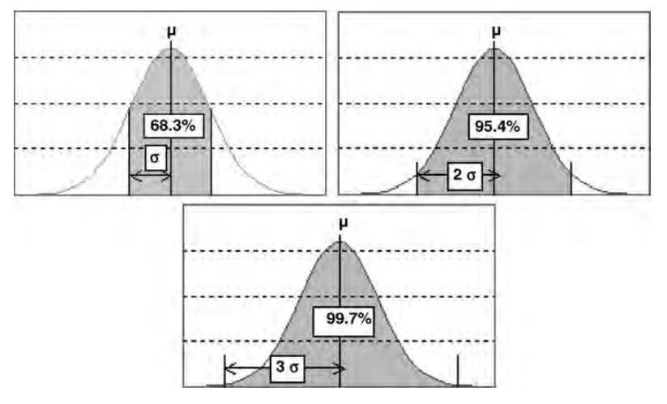
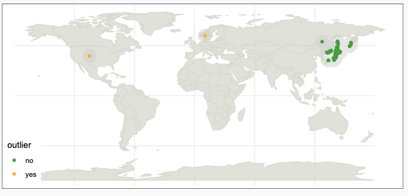

Les valeurs extrêmes (*outliers*) ne sont pas nécessairement des valeurs aberrantes. Elles peuvent correspondre à des observations rares qui sont intéressantes à détecter, et qu'il ne faut pas nécessairement supprimer. 

Par exemple, les moments de crise financières voient les prix des actions varier de manière extrême sans que cela soit une anomalie - détecter ce genre de variation est critique pour les utilisateurs du modèle.

En dehors de ces cas atypiques, on remarque que les valeurs extrêmes perturbent les modélisations, comme la régression, l'analyse discriminante et les méthodes basées sur les calculs de variance.

## Techniques classiques de gestion des valeurs extrêmes

Dans ce cas, plusieurs options sont possibles :

- Supprimer ces valeurs extrêmes (moins de 2% des observations) en vérifiant toutefois l'effet de celles-ci sur la modélisation.

- Découper le variable contenant des valeurs extrêmes en classe, ce qui affecte les observations atypiques à une classe bien spécifique.

- "Winsoriser" la variable concernée, c’est-à-dire remplacer les variables au-delà du 99ème centile et le premier centile par ce centile. Il est aussi possible d'utiliser les écarts-types, en excluant les valeurs situées au-delà de trois écarts-types.

	

Ecarts types de la loi normale [1]

## Techniques plus avancées

Des algorithmes de détection des valeurs extrêmes sont disponibles, utiles lorsque les observations ne suivent pas une loi normale.

### DBSCAN
On peut utiliser l'algorithme [[dbscan]] pour détecter les observations isolées dans notre distribution et reliées à aucun groupe de densité. Cette méthode se prête bien à l'analyse de données géographique, mais est toutefois un peu limitée. 

Un bon article didactique sur le sujet : [Outlier Detection Using DBSCAN](https://data-blog.gbif.org/post/outlier-detection-using-dbscan/)

### Stochastic Outlier Selection (SOS)
Cette méthode utilise une méthode proche de la similarité pour évaluer l'isolation des points et déterminer leur probabilité d'être des valeurs extrêmes. Un article explique plus en détail la méthode et son application : [Stochastic Outlier Selection](https://datascienceworkshops.com/blog/stochastic-outlier-selection/)

### Reste...
(à complêter) - https://scikit-learn.org/stable/modules/outlier_detection.html

#### Références :
[1] *Data Mining et Statistique Décisionnelle - L'intelligence des données*, Stéphane Tuffery, voir p. 46.